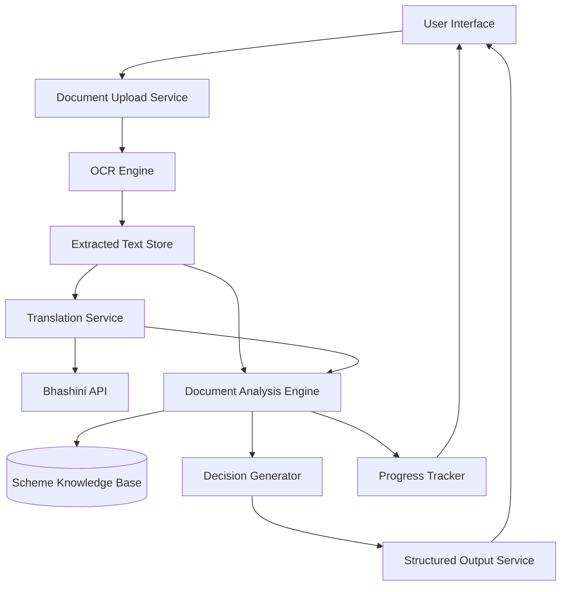

# Design Document: Citizen Application Intelligence System

## Overview

The Citizen Application Intelligence System is a multi-stage AI-powered platform that processes government documents through OCR, multilingual translation, and intelligent analysis to provide citizens with actionable guidance. The system architecture follows a pipeline pattern where documents flow through extraction, translation, analysis, and decision generation stages.

The system employs hybrid reasoning combining rule-based validation and LLM-assisted contextual understanding to interpret documents accurately and provide meaningful guidance.

The architecture is optimized for multilingual Indian government documents, supporting diverse scripts and regional administrative formats.

The system is designed with modularity and scalability in mind, starting with a limited set of welfare schemes and document types, with the ability to expand to additional schemes through configuration rather than code changes.

## Architecture

### High-Level Architecture



### Component Architecture

The system consists of the following major components:

1. **Document Upload Service**: Handles file uploads, validation, and preprocessing
2. **OCR Engine**: Extracts text from images and PDFs with confidence scoring
3. **Translation Service**: Interfaces with Bhashini API for multilingual support
4. **Document Analysis Engine**: Core intelligence that understands forms, notices, and requirements
5. **Scheme Knowledge Base**: Structured repository of scheme rules, requirements, and validation logic
6. **Decision Generator**: Produces actionable outputs with readiness scores and next steps
7. **Progress Tracker**: Maintains user state and completion tracking
8. **Structured Output Service**: Formats and delivers results to users.

### Data Flow

1. User uploads document (form or notice)
2. Document Upload Service validates format and size
3. OCR Engine extracts text with confidence scores
4. Extracted text stored with metadata (page numbers, coordinates)
5. Translation Service sends text to Bhashini API for simplification
6. Document Analysis Engine:
   - Classifies document type (application form vs rejection notice)
   - Identifies scheme from document content
   - Extracts fields, deadlines, and requirements
   - Matches against Scheme Knowledge Base
7. Decision Generator:
   - Calculates readiness score
   - Generates prioritized action items
   - Formats output with timelines
8. Results returned to user in preferred language

## Components and Interfaces

### 1. Document Upload Service

**Responsibilities:**
- Accept file uploads (JPEG, PNG, PDF)
- Validate file format, size, and basic integrity
- Generate unique document IDs
- Queue documents for OCR processing

**Interface:**
```
uploadDocument(file: File, userId: string, language: string) -> DocumentID
  Input: Binary file, user identifier, preferred language code
  Output: Unique document identifier for tracking
  Errors: InvalidFormat, FileTooLarge, CorruptedFile

getDocumentStatus(documentId: DocumentID) -> ProcessingStatus
  Input: Document identifier
  Output: Status (queued, processing, completed, failed)
  Errors: DocumentNotFound
```

**Configuration:**
- Max file size: 10MB
- Supported formats: JPEG, PNG, PDF
- Supported languages: 22 scheduled languages (ISO 639-1 codes)

### 2. OCR Engine

**Responsibilities:**
- Extract text from images and PDFs
- Detect text language and script
- Provide confidence scores for extracted text
- Handle multi-page documents
- Preserve spatial layout information

**Interface:**
```
extractText(documentId: DocumentID) -> ExtractionResult
  Input: Document identifier
  Output: {
    pages: [{
      pageNumber: int,
      textBlocks: [{
        text: string,
        confidence: float (0-1),
        language: string,
        boundingBox: {x, y, width, height}
      }]
    }],
    overallConfidence: float
  }
  Errors: ImageQualityTooLow, UnsupportedFormat, ProcessingFailed

retryExtraction(documentId: DocumentID, enhancementOptions: Options) -> ExtractionResult
  Input: Document ID, image enhancement parameters
  Output: Same as extractText
  Errors: Same as extractText
```

**Implementation Notes:**
- Use Tesseract OCR or Google Cloud Vision API
- Apply image preprocessing (deskew, denoise, contrast enhancement)
- Minimum confidence threshold: 0.7 for acceptance
- Support for Devanagari, Tamil, Telugu, Bengali, and other Indian scripts

### 3. Translation Service

**Responsibilities:**
- Interface with Bhashini API
- Simplify bureaucratic language
- Handle translation failures with retry logic
- Cache translations for common phrases

**Interface:**
```
translateAndSimplify(text: string, sourceLang: string, targetLang: string) -> TranslationResult
  Input: Text to translate, source language, target language
  Output: {
    originalText: string,
    translatedText: string,
    simplifiedText: string,
    confidence: float
  }
  Errors: BhashiniUnavailable, UnsupportedLanguagePair, TranslationFailed

batchTranslate(texts: string[], sourceLang: string, targetLang: string) -> TranslationResult[]
  Input: Array of texts, source language, target language
  Output: Array of translation results
  Errors: Same as translateAndSimplify
```

**Retry Logic:**
- Maximum 3 retry attempts
- Exponential backoff: 1s, 2s, 4s
- Fallback to cached translations if available

### 4. Document Analysis Engine

**Responsibilities:**
- Classify document type (form, notice, certificate)
- Identify applicable scheme
- Extract structured information (fields, deadlines, requirements)
- Detect rejection reasons
- Calculate document readiness

The analysis combines rule-based extraction with AI-assisted semantic reasoning to interpret contextual meaning beyond keyword matching.

**Interface:**
```
analyzeDocument(extractedText: ExtractionResult, translatedText: TranslationResult) -> AnalysisResult
  Input: OCR output, translation output
  Output: {
    documentType: enum (APPLICATION_FORM, REJECTION_NOTICE, OTHER),
    schemeId: string,
    schemeName: string,
    extractedFields: [{
      fieldName: string,
      fieldValue: string,
      isRequired: boolean,
      isComplete: boolean
    }],
    deadlines: [{
      date: Date,
      description: string,
      daysRemaining: int,
      associatedActions: string[]
    }],
    rejectionReasons: [{
      reason: string,
      category: string,
      severity: enum (CRITICAL, MODERATE, MINOR)
    }]
  }
  Errors: UnknownDocumentType, SchemeNotSupported, AnalysisFailed

identifyScheme(text: string) -> SchemeIdentification
  Input: Document text
  Output: {
    schemeId: string,
    confidence: float,
    alternativeSchemes: [{schemeId: string, confidence: float}]
  }
  Errors: NoSchemeMatch
```

**Classification Logic:**
- Use keyword matching and pattern recognition
- Machine learning model for document type classification
- Scheme identification through header text, form numbers, and department names

### 5. Scheme Knowledge Base

**Responsibilities:**
- Store scheme definitions and requirements
- Provide validation rules for each scheme
- Define required documents and field specifications
- Maintain scheme-specific business logic

**Data Model:**
```
Scheme {
  schemeId: string,
  schemeName: string,
  department: string,
  description: string,
  eligibilityCriteria: string[],
  requiredDocuments: [{
    documentType: string,
    description: string,
    isMandatory: boolean,
    acceptedFormats: string[],
    validationRules: Rule[]
  }],
  formFields: [{
    fieldId: string,
    fieldName: string,
    fieldType: enum (TEXT, NUMBER, DATE, DROPDOWN, FILE),
    isRequired: boolean,
    validationPattern: regex,
    helpText: string,
    commonMistakes: string[]
  }],
  processingTimeline: {
    averageDays: int,
    maxDays: int
  }
}
```

**Interface:**
```
getScheme(schemeId: string) -> Scheme
  Input: Scheme identifier
  Output: Complete scheme definition
  Errors: SchemeNotFound

validateField(schemeId: string, fieldId: string, value: string) -> ValidationResult
  Input: Scheme ID, field ID, field value
  Output: {
    isValid: boolean,
    errors: string[],
    suggestions: string[]
  }
  Errors: SchemeNotFound, FieldNotFound

getRequiredDocuments(schemeId: string) -> DocumentRequirement[]
  Input: Scheme identifier
  Output: List of required documents with specifications
  Errors: SchemeNotFound
```

**Initial Schemes:**
- PM-KISAN (Pradhan Mantri Kisan Samman Nidhi)
- Ayushman Bharat (Health Insurance)
- Ration Card Application
- Aadhaar Correction/Update
- Pension Schemes (Old Age, Widow, Disability)

### 6. Decision Generator

**Responsibilities:**
- Calculate document readiness score
- Generate prioritized action items
- Provide step-by-step guidance
- Estimate time requirements
- Format output for user consumption

The system prioritizes explainability, ensuring every readiness score and action recommendation can be traced back to identifiable rules or contextual reasoning.

**Interface:**
```
generateDecision(analysis: AnalysisResult, scheme: Scheme) -> DecisionOutput
  Input: Document analysis, scheme definition
  Output: {
    readinessScore: int (0-100),
    riskLevel: enum (LOW, MEDIUM, HIGH),
    actionItems: [{
      actionId: string,
      title: string,
      description: string,
      priority: int,
      estimatedTime: string,
      steps: string[],
      relatedFields: string[],
      isCompleted: boolean
    }],
    deadlines: [{
      date: Date,
      description: string,
      daysRemaining: int,
      urgency: enum (IMMEDIATE, SOON, UPCOMING)
    }],
    missingDocuments: [{
      documentType: string,
      description: string,
      howToObtain: string,
      estimatedTime: string
    }],
    nextSteps: string[],
    estimatedCompletionTime: string
  }
  Errors: InsufficientData

calculateReadinessScore(analysis: AnalysisResult, scheme: Scheme) -> int
  Input: Analysis result, scheme definition
  Output: Score from 0-100
  Errors: None
```

**Scoring Algorithm:**
- Required fields completed: 60% weight
- Required documents present: 30% weight
- Field validation passed: 10% weight
- Score < 70: High risk
- Score 70-89: Medium risk
- Score >= 90: Low risk

### 7. Progress Tracker

**Responsibilities:**
- Maintain user progress state
- Track completed action items
- Persist progress across sessions
- Trigger readiness score recalculation

**Interface:**
```
saveProgress(userId: string, documentId: DocumentID, progress: ProgressState) -> void
  Input: User ID, document ID, progress state
  Output: None
  Errors: SaveFailed

loadProgress(userId: string, documentId: DocumentID) -> ProgressState
  Input: User ID, document ID
  Output: {
    completedActions: string[],
    uploadedDocuments: string[],
    lastUpdated: Date,
    currentReadinessScore: int
  }
  Errors: ProgressNotFound

markActionComplete(userId: string, documentId: DocumentID, actionId: string) -> UpdatedDecision
  Input: User ID, document ID, action ID
  Output: Updated decision with new readiness score
  Errors: ActionNotFound, UpdateFailed
```

**Storage:**
- Use persistent storage (database or file system)
- Index by userId and documentId
- Include timestamps for audit trail

### 8. Structured Output Service

**Responsibilities:**
- Format decision output for display
- Apply language-specific formatting
- Generate user-friendly summaries
- Provide export capabilities

**Interface:**
```
formatOutput(decision: DecisionOutput, language: string) -> FormattedOutput
  Input: Decision output, target language
  Output: {
    summary: string,
    readinessIndicator: {
      score: int,
      visual: string (progress bar representation),
      message: string
    },
    actionList: FormattedAction[],
    deadlineList: FormattedDeadline[],
    documentChecklist: FormattedDocument[]
  }
  Errors: FormattingFailed

exportOutput(decision: DecisionOutput, format: enum (PDF, JSON, TEXT)) -> File
  Input: Decision output, export format
  Output: File in requested format
  Errors: ExportFailed, UnsupportedFormat
```

## Data Models

### Core Data Structures

**Document:**
```
{
  documentId: string (UUID),
  userId: string,
  uploadTimestamp: Date,
  fileName: string,
  fileSize: int,
  mimeType: string,
  preferredLanguage: string,
  processingStatus: enum (UPLOADED, OCR_PROCESSING, TRANSLATING, ANALYZING, COMPLETED, FAILED),
  ocrResult: ExtractionResult,
  translationResult: TranslationResult,
  analysisResult: AnalysisResult,
  decisionOutput: DecisionOutput
}
```

**User Session:**
```
{
  userId: string,
  sessionId: string,
  preferredLanguage: string,
  activeDocuments: DocumentID[],
  progressStates: Map<DocumentID, ProgressState>
}
```

**Action Item:**
```
{
  actionId: string,
  title: string,
  description: string,
  priority: int (1-5, 1 is highest),
  category: enum (FILL_FIELD, UPLOAD_DOCUMENT, CORRECT_ERROR, VERIFY_INFO),
  estimatedMinutes: int,
  steps: string[],
  relatedRequirements: string[],
  isCompleted: boolean,
  completedTimestamp: Date
}
```

## Correctness Properties

*A property is a characteristic or behavior that should hold true across all valid executions of a system—essentially, a formal statement about what the system should do. Properties serve as the bridge between human-readable specifications and machine-verifiable correctness guarantees.*


### Property 1: OCR Text Extraction Completeness
*For any* valid image file (JPEG, PNG, PDF) containing known text content, the OCR_Engine should extract all visible text with confidence scores between 0 and 1 for each text block.

**Validates: Requirements 1.1, 1.3**

### Property 2: Multi-Page Document Order Preservation
*For any* multi-page PDF document, the number of extracted pages should equal the number of input pages, and the page order should be preserved in the extraction result.

**Validates: Requirements 1.5**

### Property 3: Language Preservation in Multilingual Documents
*For any* document containing text in multiple languages, each extracted text segment should retain its original language identifier.

**Validates: Requirements 1.2**

### Property 4: Translation Output Structure
*For any* translation request, the result should contain both the original text and the translated text, regardless of the source or target language.

**Validates: Requirements 2.3, 4.2**

### Property 5: Translation Service Retry Behavior
*For any* Bhashini API failure, the system should retry the request exactly 3 times before returning an error to the user.

**Validates: Requirements 2.4, 10.2**

### Property 6: Language Support Completeness
*For any* of the 22 scheduled languages of India (as defined by ISO 639-1 codes), the system should accept it as a valid language selection.

**Validates: Requirements 2.5**

### Property 7: Required Field Identification
*For any* application form belonging to a known scheme, the system should identify all required fields as defined in the Scheme Knowledge Base.

**Validates: Requirements 3.1**

### Property 8: Readiness Score Calculation
*For any* document analysis result, the system should calculate a Document_Readiness_Score between 0 and 100 based on completed required items.

**Validates: Requirements 3.2**

### Property 9: Missing Items Completeness
*For any* document with a readiness score below 100, the system should list all missing or incomplete items that contribute to the score deficit.

**Validates: Requirements 3.3**

### Property 10: Complete Document Perfect Score
*For any* document where all required fields are present and all required documents are uploaded, the Document_Readiness_Score should equal 100.

**Validates: Requirements 3.5**

### Property 11: Item Categorization Validity
*For any* missing item or identified date, the system should assign it a valid category from the predefined set (for missing items: "Critical" or "Recommended"; for dates: "Deadline", "Informational", or "Event").

**Validates: Requirements 3.4, 5.2**

### Property 12: Rejection Reason Extraction
*For any* rejection notice containing stated reasons, the system should extract all reasons present in the document.

**Validates: Requirements 4.1**

### Property 13: Action Item Generation from Rejection Reasons
*For any* identified rejection reason, the system should generate at least one Action_Item that addresses the issue.

**Validates: Requirements 4.3**

### Property 14: Action Item Prioritization
*For any* set of multiple Action_Items, they should be ordered by priority value, with lower priority numbers appearing first.

**Validates: Requirements 4.4**

### Property 15: Date Extraction Completeness
*For any* document containing dates in recognizable formats, the system should identify all dates present in the text.

**Validates: Requirements 5.1**

### Property 16: Deadline Days Calculation
*For any* identified deadline, the calculated days remaining should equal the deadline date minus the current date.

**Validates: Requirements 5.3**

### Property 17: Deadline Action Association
*For any* deadline with associated action verbs or requirements in the surrounding text, those actions should be extracted and linked to the deadline.

**Validates: Requirements 5.4**

### Property 18: Chronological Deadline Sorting
*For any* set of multiple deadlines, they should be sorted in ascending chronological order with the nearest deadline first.

**Validates: Requirements 5.5**

### Property 19: Decision Output Structure Completeness
*For any* completed document analysis, the generated decision output should contain all required fields: Document_Readiness_Score, Action_Items list, and Deadlines list.

**Validates: Requirements 6.1**

### Property 20: Action Item Instruction Completeness
*For any* Action_Item in the decision output, it should include step-by-step instructions and an estimated time to complete.

**Validates: Requirements 6.2, 6.4**

### Property 21: Risk Level Threshold
*For any* Document_Readiness_Score below 70, the risk level should be marked as "High Risk of Rejection".

**Validates: Requirements 6.3**

### Property 22: Score Update on Action Completion
*For any* Action_Item marked as completed, the system should recalculate the Document_Readiness_Score, and the new score should be greater than or equal to the previous score.

**Validates: Requirements 6.5**

### Property 23: Field Guidance Completeness
*For any* valid form field in a supported scheme, the system should provide help text, format examples (if format rules exist), common mistake warnings (if configured), and acceptable document lists (if documents are required).

**Validates: Requirements 7.1, 7.2, 7.3, 7.5**

### Property 24: Guidance Language Consistency
*For any* help request, the returned guidance should be in the user's preferred language as specified in their session.

**Validates: Requirements 7.4**

### Property 25: Document Validation Execution
*For any* uploaded supporting document, the system should perform format validation, size validation, and quality assessment (for images).

**Validates: Requirements 8.1, 8.2, 8.3**

### Property 26: Identity Document Expiry Validation
*For any* identity document with a visible expiry date, the system should validate that the expiry date is not in the past relative to the current date.

**Validates: Requirements 8.5**

### Property 27: Validation Error Guidance
*For any* document that fails validation, the system should provide an error message explaining the failure reason and suggesting corrective actions.

**Validates: Requirements 8.4, 10.3**

### Property 28: Progress Persistence Round Trip
*For any* user progress state, saving the state and then loading it should return an equivalent state with all completed actions and uploaded documents preserved.

**Validates: Requirements 9.2, 9.3**

### Property 29: Progress Score Recalculation
*For any* Action_Item completion event, the system should mark the action as complete and recalculate the Document_Readiness_Score.

**Validates: Requirements 9.1**

### Property 30: Progress Percentage Calculation
*For any* progress state, the system should calculate a completion percentage equal to (completed actions / total actions) × 100.

**Validates: Requirements 9.4**

### Property 31: Completion Confirmation Display
*For any* progress state where all Action_Items are marked complete, the system should display a "Ready to Submit" confirmation message.

**Validates: Requirements 9.5**

### Property 32: Error Message Language Consistency
*For any* error that occurs during processing, the error message should be provided in the user's preferred language.

**Validates: Requirements 10.1**

### Property 33: Error Logging with Timestamps
*For any* error that occurs in the system, a log entry should be created containing the error details and a timestamp.

**Validates: Requirements 10.4**

### Property 34: Service Unavailability Messaging
*For any* system service that becomes temporarily unavailable, the system should display an error message with an estimated time for service restoration.

**Validates: Requirements 10.5**

## Error Handling

### Error Categories

The system defines the following error categories:

1. **User Input Errors**: Invalid file format, file too large, corrupted file
2. **Processing Errors**: OCR failure, image quality too low, unsupported document type
3. **External Service Errors**: Bhashini API unavailable, network timeout
4. **Data Errors**: Scheme not found, invalid field value, missing required data
5. **System Errors**: Database unavailable, storage failure, unexpected exceptions

### Error Handling Strategy

**User Input Errors:**
- Validate immediately upon upload
- Provide clear, actionable error messages
- Suggest corrections (e.g., "Please upload a file smaller than 10MB")
- Allow immediate retry

**Processing Errors:**
- Attempt automatic recovery (image enhancement, retry with different OCR settings)
- If recovery fails, explain the issue in user's language
- Provide guidance on how to improve input (e.g., "Please take a clearer photo with better lighting")
- Log error details for system monitoring

**External Service Errors:**
- Implement retry logic with exponential backoff
- Use cached data when available
- Display user-friendly messages ("Translation service is temporarily busy, retrying...")
- Fail gracefully after maximum retries
- Log service availability metrics

**Data Errors:**
- Validate against Scheme Knowledge Base
- Provide specific field-level error messages
- Suggest valid values or formats
- Allow partial progress saving

**System Errors:**
- Log detailed error information for debugging
- Display generic user-friendly message
- Attempt graceful degradation (e.g., skip optional features)
- Alert system administrators for critical failures

### Retry Logic

**OCR Processing:**
- Single retry with image enhancement
- If confidence < 0.7, request better image from user

**Bhashini API:**
- 3 retries with exponential backoff (1s, 2s, 4s)
- Check cache before each retry
- Fail with clear message after 3 attempts

**Database Operations:**
- 2 retries for transient failures
- Immediate failure for constraint violations

### Error Messages

All error messages must:
- Be translated to user's preferred language
- Explain what went wrong in simple terms
- Provide specific corrective actions
- Avoid technical jargon
- Include support contact information for unrecoverable errors

## Testing Strategy

### Dual Testing Approach

The system will employ both unit testing and property-based testing to ensure comprehensive coverage:

**Unit Tests:**
- Specific examples demonstrating correct behavior
- Edge cases (empty documents, single-page PDFs, boundary values)
- Error conditions (invalid formats, API failures, missing data)
- Integration points between components
- Scheme-specific validation rules

**Property-Based Tests:**
- Universal properties that hold across all inputs
- Comprehensive input coverage through randomization
- Validation of invariants and business rules
- Round-trip properties (save/load, parse/format)
- Minimum 100 iterations per property test

### Property-Based Testing Configuration

**Framework Selection:**
- Python: Use Hypothesis library
- TypeScript/JavaScript: Use fast-check library
- Java: Use jqwik library

**Test Configuration:**
- Minimum 100 iterations per property test
- Each test tagged with: **Feature: citizen-application-intelligence, Property {number}: {property_text}**
- Seed-based reproducibility for failed tests
- Shrinking enabled to find minimal failing examples

**Test Organization:**
- One property-based test per correctness property
- Tests grouped by component
- Shared generators for common data types (documents, schemes, users)

### Test Data Generation

**Generators Needed:**
- Valid image files with embedded text (various languages and scripts)
- Multi-page PDF documents
- Application forms for supported schemes
- Rejection notices with various reason patterns
- User sessions with different language preferences
- Progress states with varying completion levels
- Invalid inputs (corrupted files, unsupported formats, expired documents)

### Integration Testing

**Component Integration:**
- OCR → Translation pipeline
- Translation → Analysis pipeline
- Analysis → Decision Generation pipeline
- Progress Tracker → Decision Generator interaction

**External Service Integration:**
- Bhashini API integration with mock service for testing
- Database persistence and retrieval
- File storage operations

### Test Coverage Goals

- Unit test coverage: Minimum 80% code coverage
- Property test coverage: All 34 correctness properties implemented
- Integration test coverage: All component interfaces
- End-to-end test coverage: Complete workflows for each supported scheme

### Testing Priorities

1. **Critical Path**: Document upload → OCR → Translation → Analysis → Decision output
2. **Data Integrity**: Progress persistence, score calculation accuracy
3. **Error Handling**: All error categories with appropriate recovery
4. **Multilingual Support**: All 22 languages with proper translation
5. **Scheme Coverage**: All initially supported schemes validated

### Performance Testing

While not part of unit/property testing, the following performance criteria should be validated:

- OCR processing: < 5 seconds per page
- Translation: < 2 seconds per request
- Analysis: < 3 seconds per document
- End-to-end processing: < 15 seconds for typical document
- Concurrent users: Support 100 simultaneous users

## Implementation Notes

### Technology Recommendations

**OCR Engine:**
- Primary: Tesseract OCR 5.x with Indic language support
- Alternative: Google Cloud Vision API for higher accuracy
- Preprocessing: OpenCV for image enhancement

**Translation Service:**
- Bhashini API (Government of India)
- Fallback: Local translation cache for common phrases

**Backend Framework:**
- Python: FastAPI or Flask for REST API
- Node.js: Express or NestJS for TypeScript implementation
- Java: Spring Boot for enterprise deployment

**Database:**
- PostgreSQL for structured data (schemes, users, progress)
- MongoDB for document storage (OCR results, analysis outputs)
- Redis for caching (translations, session data)

**File Storage:**
- Local filesystem for development
- S3-compatible storage for production (AWS S3, MinIO)

**Frontend:**
- React or Vue.js for web interface
- Mobile-responsive design
- Progressive Web App (PWA) for offline capability

### Scalability Considerations

**Initial Deployment:**
- Single server deployment
- Support 5 schemes initially
- Designed to support small-scale pilot deployments with potential to scale to larger user bases
- Process 1000 documents per day

**Future Scaling:**
- Horizontal scaling with load balancer
- Architecture designed to evolve toward microservices as adoption grows
- Message queue (RabbitMQ, Kafka) for asynchronous processing
- CDN for static assets and cached translations
- Database replication for read scaling

### Security Considerations

- HTTPS for all communications
- User authentication and authorization
- Document encryption at rest
- PII data handling compliance
- Rate limiting to prevent abuse
- Input sanitization to prevent injection attacks
- Audit logging for all document access

### Monitoring and Observability

- Application performance monitoring (APM)
- Error tracking and alerting
- OCR accuracy metrics
- Translation service availability
- User journey analytics
- System resource utilization

## Future Enhancements

### Phase 2 Features

- Support for additional schemes (expand from initial 5)
- Voice input for form filling
- Automated form filling from extracted data
- Integration with government portals for direct submission
- SMS notifications for deadlines
- Offline mode with sync capability

### Phase 3 Features

- AI-powered document generation
- Predictive application success scoring
- Community knowledge base for scheme-specific tips
- Multi-user family account management
- Integration with digital identity systems (DigiLocker)
- Real-time application status tracking

## Appendix

### Supported Schemes (Initial Release)

1. **PM-KISAN**: Direct income support for farmers
2. **Ayushman Bharat**: Health insurance scheme
3. **Ration Card**: Food security entitlement
4. **Aadhaar Services**: Identity document corrections
5. **Social Pension**: Old age, widow, and disability pensions

### Language Codes (22 Scheduled Languages)

Assamese (as), Bengali (bn), Bodo (brx), Dogri (doi), Gujarati (gu), Hindi (hi), Kannada (kn), Kashmiri (ks), Konkani (kok), Maithili (mai), Malayalam (ml), Manipuri (mni), Marathi (mr), Nepali (ne), Odia (or), Punjabi (pa), Sanskrit (sa), Santali (sat), Sindhi (sd), Tamil (ta), Telugu (te), Urdu (ur)

### Document Type Classifications

- Application Form
- Rejection Notice
- Approval Letter
- Request for Additional Information
- Identity Document
- Address Proof
- Income Certificate
- Caste Certificate
- Age Proof
- Bank Statement